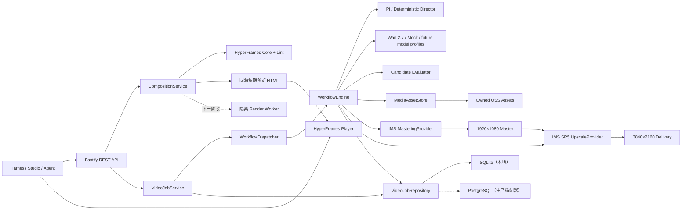

# Architecture

## 当前模块化单体

## 边界原则

- Agent 只负责需要推理和工具调用的决策，不承担长时间供应商任务的可靠性。
- `WorkflowEngine` 只依赖端口：Director、Provider、Evaluator、DeliveryPipeline、Repository。
- 百炼请求和响应只存在于 Provider 内部；上层使用统一任务和错误模型。
- 云端密钥只从运行时环境读取，日志对鉴权字段执行脱敏。
- 生成素材与 4K 母版分层；Wan 输出最高 1080P，4K 由独立的云端 `UpscaleProvider` 完成。
- FFmpeg 不是超分实现；以后如引入，仅承担确定性的探测、封装、混音或编码辅助。
- Wan 与 HyperFrames 不是两套产品：Wan 负责生成像素素材，HyperFrames 负责可复现的排版、动效和合成；二者由同一 Harness Studio 和 `CompositionSpec` 协调。
- Studio 不接收任意 HTML/JavaScript。用户只提交经过 Zod 校验的结构化参数，服务端生成固定模板并通过 HyperFrames 官方 lint 后才暴露随机预览 URL。

## 已实现与下一阶段

| 层 | 当前实现 | 下一阶段 |
| --- | --- | --- |
| Director | 确定性分镜；Pi Agent Core 工具提交适配器；结构与时长契约测试 | 接入独立百炼文本模型 Key，增加脚本/角色 Bible/视觉连续性 |
| Workflow | 状态机、逐任务检查点、跨进程恢复、取消、显式重试 | 持久化队列、退避重试、供应商回调、镜头级重做 |
| Provider | Mock；Wan 2.7 T2V；2.7 已真实验证 | 为 Wan 3.0、I2V/R2V 和 Seedance 2.5 分别增加经过官方契约验证的模型 Profile |
| Evaluator | 首个成功候选 | VLM 多维评分与低置信度补抽 |
| Delivery | OSS 转存、IMS 1080P 母版、IMS SR5 4K、原子清单 | 字幕、独立配音/BGM 与成片 QC |
| Composition | 安全标题卡模板、HyperFrames Core lint、官方 Player、与当前 Wan 候选联动 | 持久化 CompositionSpec、模板库、字幕/图表/转场、隔离 Render Worker |
| Operations | Bearer 鉴权、OpenAPI、健康/就绪、Prometheus gauge、成本预算 | 分布式 tracing、实际账单回填与告警 |
| Storage | Node SQLite + OSS | PostgreSQL；BullMQ/Redis 或 Temporal 适配器 |

SQLite 仅用于单节点开发和首个纵向切片。接口已经隔离，进入多实例部署前切换 PostgreSQL 和持久化队列，不改变 API 与领域模型。
