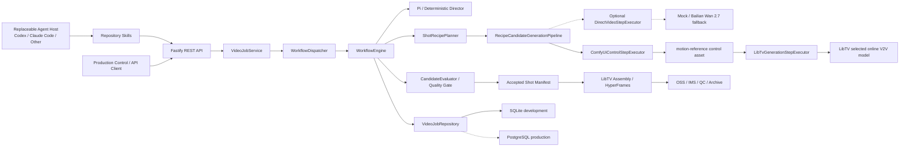
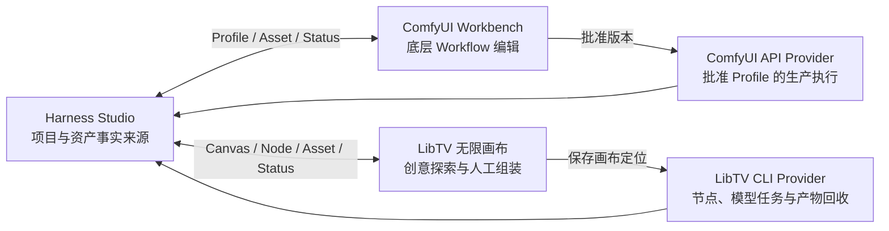
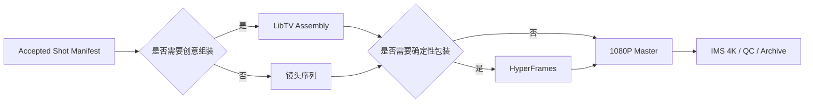

# Architecture

## 1. 系统定位

本项目中的 **Video Agent Harness** 是 TypeScript/Node.js 控制面，不等同于 ComfyUI，也不包含 4K 编码、字幕包装等全部后期工作。它负责把创作目标转换成可持久化的镜头执行配方，调用不同执行器，保存任务与素材血缘，并把结果送入质量门禁。

- **Agent Harness：** 剧本/镜头规划、执行配方、模型与渠道选择、步骤检查点、评价、重试策略、一致性与成本治理。
- **顶层创作 Skill：** `create-production-video` 保存从 Brief、分镜、逐镜头生成、评价、组装到交付的流程知识，并调用专业子 Skill；它不直接调 H3 Sampler。
- **专业子 Skill：** `generate-minimax-h3-shot`、`libtv-cli`、`review-video-candidate` 分别处理 H3 单镜头、LibTV 操作和质量诊断，通过类型化契约向顶层返回结果。
- **ComfyUI：** 深层推理工作流执行器，可操作 H3、LoRA、ControlNet、Sampler、VAE 等节点；它是 Harness 的工具，不是整个 Agent。
- **LibTV：** 同时提供创意画布、在线模型生成和创意组装能力；Harness 只通过官方 CLI 操作。
- **Post-production：** HyperFrames 等确定性字幕、品牌包装、数据动效与剪辑。
- **Delivery：** OSS、IMS、技术 QC、4K、归档和下载。

## 2. 总体架构

Skill、开发期 MCP、生产 Provider 与完整数据产物的展开图见 [`SKILLS_AND_SYSTEM_MAP.md`](./SKILLS_AND_SYSTEM_MAP.md)。本节保留运行时主干视图。



`Execution Router` 的产物不是单个 Provider 名字，而是一张 `ShotRecipe`。因此 ComfyUI、LibTV 和百炼既可以作为不同配方的替代路径，也可以在同一配方中形成上下游。

### 2.1 Studio 与专业画布

Studio 不属于 ComfyUI 的“皮肤层”，而是位于所有生成与交付工具之上的项目控制面。ComfyUI 和 LibTV 都以两个身份接入：面向人的 Workbench，以及面向生产 Harness 的 API/CLI Provider。



三者采用“入口、标识、状态和血缘合并；专业编辑器不合并”。详细边界、数据所有权和当前实现差距见 [`STUDIO_WORKBENCH_BOUNDARY.md`](./STUDIO_WORKBENCH_BOUNDARY.md)。

项目控制面已使用与 VideoJob 同库的 SQLite Repository 持久化以下主数据：

```text
ProductionProject
  → StoryScene[]
  → CharacterPack[] / ScenePack[]
  → ProjectAsset[]（版本与职责）
  → WorkbenchBindings（ComfyUI Profile / LibTV Canvas）
  → VideoJob[]
```

`POST /v1/projects/:id/video-jobs` 会先校验 Scene 是否属于项目，再创建 Job，并把关联同时写回 Project 与 Job Request，避免只有 UI 临时状态的“伪项目关系”。

## 3. 高控制镜头主路径


当前已实现的实际数据流：

1. 先只读解析 Workflow、检查 ComfyUI `system_stats`、LibTV 画布和模型 Schema；失败时不提交生成或上传。
2. `ComfyUiLibTvShotRecipePlanner` 生成两步配方：`control-pass` 与 `final-generation`。
3. ComfyUI API Workflow 中的 Harness Token 被替换为镜头 Prompt、帧数、分辨率、Seed 等实际值。
4. Harness 调用 ComfyUI `/prompt`，保存 `prompt_id`，并通过 `/history/{prompt_id}` 恢复或等待结果。
5. 输出视频从局域网 ComfyUI 下载到 `.data/control-assets/<jobId>/`，登记为 `motion-reference`。
6. `LibTvGenerationStepExecutor` 使用官方 `libtv upload` 上传本地控制视频为画布资源节点。
7. Harness 创建一个 LibTV `video` 节点，把控制视频连到左侧，以 `video2video` 调用当前 Profile 选择的线上模型。Wan 2.7 是已验证的首个模型实现，不是主流程硬编码的架构依赖。
8. LibTV 最终视频登记为 `final-video`，再进入结构化评价与选片。

LibTV CLI 的 `--run` 本身会同步等待终态；Harness 不在 CLI 外重复轮询。ComfyUI 是异步协议，Harness 自己保存 `prompt_id` 并轮询历史。

## 4. LibTV 的三个架构角色

三个角色共用 `LibTvCliClient`，但不能合并成一个职责模糊的 Provider。

| 角色 | 代码适配器 | 官方 CLI 能力 | 主工作流状态 |
| --- | --- | --- | --- |
| 创意规划 | `LibTvScriptAdapter` | `node create -t script`、`script storyboard` | 已实现适配器，尚未默认接入 Director |
| 在线生成 | `LibTvGenerationStepExecutor` | `upload`、`node create -t video --run` | 已接入 `comfyui-libtv` 配方 |
| 创意组装 | `LibTvAssemblyAdapter` | `node create -t video-clip`、时间线合成 | 已实现简单拼接适配器，尚未默认接入交付 |

LibTV 视频生成只能使用在线模型 Schema 暴露的参数。当前验证过的 Wan 2.7 Schema 支持一条参考视频的 `video2video`，时长 2–10 秒、720P/1080P。它不暴露 ComfyUI 的 KSampler、VAE、ControlNet 或 LoRA 权重；这些控制必须在前置 ComfyUI Workflow 完成。

## 5. ShotRecipe 与资产血缘

领域模型位于 `src/domain/execution-recipe.ts`。

```ts
interface ShotRecipe {
  id: string;
  profile: "direct" | "comfyui-libtv";
  steps: ShotRecipeStep[];
}

interface GenerationAsset {
  role:
    | "motion-reference"
    | "pose-reference"
    | "camera-reference"
    | "depth-reference"
    | "first-frame"
    | "last-frame"
    | "style-reference"
    | "final-video";
  uri: string;
  localPath?: string;
  sourceExecutor: RecipeExecutor;
  sourceTaskId?: string;
}
```

每个 `ShotCandidate` 持久化：

- `recipe`：执行图与参数；
- `executions[]`：每一步的状态、尝试次数、任务 ID、错误和输出资产；
- `assets[]`：可供下游按角色读取的中间/最终资产；
- `evaluation`：质量维度、问题、决策和建议参数补丁；
- `outputUrl`：通过完整配方得到的最终视频。

控制视频不是“低质量成片”，而是具有明确语义的中间资产。`motion-reference` 表示下游应尽量保持动作、镜头轨迹、构图和节奏，而材质、人物细节、灯光和时序稳定性可以由在线模型提高。

## 6. 两种已实现配方

### `direct`

```text
video-provider(final-generation) -> final-video
```

继续支持 Mock 或百炼 Wan 2.7 T2V，作为无云费用的安全开发路径、供应商回退、效果对照和真实烟测。它不属于当前产品主流程；配置层仍默认 `direct + mock`，只是为了让未配置 ComfyUI/LibTV 的本地启动不会误上传素材或产生费用。

### `comfyui-libtv`

```text
comfyui-control(control-pass)
  -> motion-reference
  -> libtv-generation(final-generation, video2video)
  -> final-video
```

这是当前产品主流程，适合人物动作、镜头运动和构图控制要求较高的镜头。当前配置对整项任务使用同一 Recipe Profile；下一阶段由智能 Recipe Planner 在 ComfyUI→LibTV、ComfyUI-only 与受控回退路径之间按镜头选择。百炼 Wan 2.7 直连不会进入默认生产路由。

## 7. ComfyUI Workflow 契约

`COMFYUI_WORKFLOW_PATH` 必须指向 ComfyUI 的 **API-format Workflow JSON**。Harness 会递归替换以下 Token；当整个 JSON 值就是 Token 时会保留数字类型。

| Token | 类型 | 含义 |
| --- | --- | --- |
| `{{HARNESS_PROMPT}}` | string | 当前镜头生成提示词 |
| `{{HARNESS_DURATION_SECONDS}}` | number | 镜头秒数 |
| `{{HARNESS_FRAME_COUNT}}` | number | `duration × fps + 1` |
| `{{HARNESS_FPS}}` | number | 默认 24 |
| `{{HARNESS_WIDTH}}` / `{{HARNESS_HEIGHT}}` | number | 默认 1280×720 控制视频 |
| `{{HARNESS_SEED}}` | number | 根据候选 ID 稳定派生 |
| `{{HARNESS_CLIENT_REQUEST_ID}}` | string | Job/Candidate 幂等标识 |

示例片段：

```json
{
  "6": {
    "class_type": "CLIPTextEncode",
    "inputs": { "text": "{{HARNESS_PROMPT}}" }
  },
  "42": {
    "class_type": "SomeVideoNode",
    "inputs": {
      "width": "{{HARNESS_WIDTH}}",
      "height": "{{HARNESS_HEIGHT}}",
      "num_frames": "{{HARNESS_FRAME_COUNT}}",
      "seed": "{{HARNESS_SEED}}"
    }
  }
}
```

不同本地节点包使用不同输入字段，因此 Harness 不猜测节点 ID，也不擅自改写 LoRA、ControlNet、Sampler 或 VAE。用户从 ComfyUI 导出并验证 Workflow 后，只在需要动态化的输入位置放置 Token。

## 8. 质量循环

`CandidateEvaluator` 已从“返回候选 ID”升级成结构化 `EvaluationReport`：

- 人物一致性；
- 动作质量；
- Prompt 对齐；
- 时序稳定性；
- 技术质量；
- `accept / revise-control / regenerate-final / human-review`；
- 针对某一步的参数修改建议。

当前 `FirstSuccessfulCandidateEvaluator` 是兼容基线：为第一个成功候选写入结构化 `accept` 报告，但尚未执行真实 VLM 视觉评分。自动根据 `revise-control` 回跳 ComfyUI、根据 `regenerate-final` 只重跑 LibTV，是下一实现切片；不能把当前基线描述成已经具备真实质量识别。

质量门必须按生产阶段分层，不能用最终成片标准阻断动作草稿：

| Stage | 主要回答的问题 | 阻断项 | 仅告警项 |
| --- | --- | --- | --- |
| `control-draft` | 动作、走位、机位、节奏、空间和接缝是否可用于下游 | 动作不可辨认、运镜方向错误、严重时序故障、文件不可用 | 脸、服装、材质、皮肤和光影的非灾难性漂移 |
| `final-candidate` | LibTV / 高质量 H3 / SD 精修结果是否能作为成片镜头 | 人物身份、外观、Prompt、运动、时序、技术质量未达标 | 非关键审美差异 |
| `delivery` | 已接受镜头是否满足交付规范 | 编码、音轨、时长、分辨率、黑帧、冻结、损坏和归档错误 | 不影响规范的创意偏差 |

代码中的 `qualityGatePolicies` 固化这一差异。一个回头后脸部漂移、但动作路径正确的 H3 草稿可返回 `pass-with-warnings`；同一问题出现在最终精修候选中必须返回 `fail`。

## 8.1 Story → Scene → Shot → Candidate

长视频不直接把一个 Prompt 拉长，而是使用四级持久化结构：


`src/domain/story-production.ts` 定义场景连续锚点、镜头输入/输出状态、生成时长与选用区间，以及场景组装时间线。相邻镜头必须显式记录 `previousShotId` 和接力首帧；人物、地点、服装、光线与音床属于场景级锚点，不应由每条 Prompt 重新发明。

## 9. 后期与交付边界



这里不再使用“Agent Harness 收回剪辑决策”的表述。LibTV Assembly、HyperFrames、IMS 是 AI 生成后的创意组装、确定性后期和交付管线；它们可以被 Harness 调度，但不用于定义 AI Agent Harness 本身。

## 10. 恢复与幂等边界

- Direct Provider：提交后立刻保存供应商 Task ID，重启后只轮询，不重复付费提交。
- ComfyUI：保存 `prompt_id`；重启后查询历史并下载已经完成的控制视频。
- LibTV：候选 ID派生稳定资源节点名和输出节点名；重启后先查询画布，已有输出则复用，已有节点但无输出则只重新运行该节点。
- 每一步成功后独立写入 SQLite；最终 Manifest Schema v3 包含 Recipe、步骤记录和评价报告。
- 本地 SQLite/进程内队列仍只适合单实例开发。多实例生产必须切换数据库和持久化队列。

## 11. 流量与费用

仅设置 `GENERATION_PIPELINE=comfyui-libtv` 并创建真实任务时才会执行以下流量：

1. Mac 从局域网 ComfyUI 下载控制视频；
2. `libtv upload` 把控制视频上传到 LibTV，产生公网流量；
3. LibTV 在线模型生成会产生平台费用；
4. 云交付开启后，Harness 再把最终视频转存 OSS，并可能调用 IMS。

代码和测试使用 Fake/Mock，不上传素材、不运行在线模型。对流量敏感时应把 `SHOT_CANDIDATES=1`，先用短镜头验证 Workflow 和模型 Schema。

## 12. Wan × HyperFrames 确定性合成

`CompositionSpec.backgroundClips` 仍是 AI 底片与确定性合成之间的契约。每个 clip 包含 `videoUrl`、合成时间线上的 `startSeconds`、使用时长 `durationSeconds` 和源视频裁切起点 `mediaStartSeconds`。HyperFrames 可以在最终视频上叠加可复现文字、卡片、Logo 和转场；不要把包含清晰文字的成片再次交给生成模型重绘。

## 13. 当前实现状态

| 层 | 已实现 | 下一阶段 |
| --- | --- | --- |
| Director | 确定性分镜、Pi 工具提交、Recipe 最大镜头时长约束 | 角色 Bible、LibTV 创意画布可选接入 |
| Recipe | `direct`、`comfyui-libtv`、步骤和资产检查点 | 按镜头能力/成本智能选择、并行 DAG |
| ComfyUI | `/prompt`、`/history`、输出下载、Token 化 Workflow；FL2VA 首尾帧与 REF2VA 四图身份 Profile 均已完成本地实测 | 把 Profile 的图片上传和动态参考槽绑定接入生产 Executor |
| LibTV | 官方 CLI Client、视频上传、Wan 2.7 V2V、脚本和简单组装适配器 | 真实画布纵向验收、精细时间线和更多模型能力 Profile |
| Evaluator | 结构化报告契约、兼容基线 | VLM 多维评分、局部回跳和最多候选数策略 |
| Delivery | OSS、IMS 1080P 母版、SR5 4K、Manifest v3 | 字幕、独立配音/BGM、成片技术 QC |
| Composition | HyperFrames 安全模板、AI 背景 timed clips | 自动从 Accepted Shot Manifest 建立合成规格 |

## 14. 本地 H3 垂直切片验收（2026-08-18）

第一条真实本地控制样本采用三张同一人物照片：正面图作为首帧、右前侧图作为尾帧，纯右侧面图作为不参与采样的留出验证素材。执行图使用本地 MiniMax H3 FL2VA FP8、4-step Turbo LoRA、`res_multistep + simple`、864×480、124 帧、24fps；未调用 Partner API、百炼或 LibTV。

结果成功产出 5.167 秒 H.264/AAC 横屏视频；ComfyUI 节点校验为零错误，采样约 37 秒，冷启动总执行约 192 秒。抽帧检查未发现明显人物替换、重复脸、黑帧或超过 0.5 秒的冻结段。该结果证明“Skill 路由 → 节点能力发现 → 类型化参数 → 本地 ComfyUI 执行 → 技术检查 → Profile 固化”的开发期闭环可运行。

第二轮验收安装 REF2VA FP8 权重，使用三张原始人物图完成单人基线，并以四图 Profile 重跑门口故事第 5、6 镜。新流程每镜重新注入原始 Character Pack，把上一镜图降级为场景状态参考，实际消除了旧版逐镜尾帧接力导致的明显换脸。两镜均为 864×480、124 帧、20 steps、`res_multistep + normal`，没有使用 Turbo LoRA。

已登记的两个 Profile 位于 `skills/generate-minimax-h3-shot/profiles/`，状态均为 `development-validated`，不是 `production-approved`。尚未完成的边界必须继续如实保留：

- 当前 Harness 的通用 Workflow Token 替换器尚未负责图片上传与 `HARNESS_FIRST_FRAME` / `HARNESS_LAST_FRAME` 绑定；本次由 H3 Skill 的开发期流程完成上传和提交。
- 当前机器已安装 FL2VA 与 REF2VA FP8。四参考图 REF2VA 已验证，但生产 Executor 尚未负责上传图片并绑定 `HARNESS_REF_IMAGE_1..4`；本次仍由 H3 Skill 的开发期流程完成上传和提交。
- REF2VA 与 FL2VA 应按 `modelAffinity` 分批调度，避免逐镜交替换模；四图以上和更高分辨率尚未通过 16GB 显存验收。
