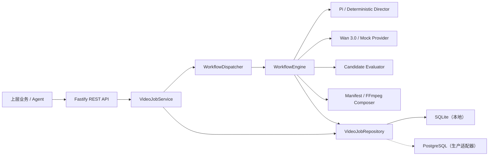

# Architecture

## 当前模块化单体

## 边界原则

- Agent 只负责需要推理和工具调用的决策，不承担长时间供应商任务的可靠性。
- `WorkflowEngine` 只依赖端口：Director、Provider、Evaluator、Composer、Repository。
- 百炼请求和响应只存在于 Provider 内部；上层使用统一任务和错误模型。
- 云端密钥只从运行时环境读取，日志对鉴权字段执行脱敏。
- 生成素材与 4K 母版分层；Wan 3.0 当前最高 1080P，由后期执行面负责超分和交付编码。

## 已实现与下一阶段

| 层 | 当前实现 | 下一阶段 |
| --- | --- | --- |
| Director | 确定性分镜；Pi 工具提交适配器 | 接入百炼文本模型，增加脚本/角色 Bible/视觉连续性 |
| Workflow | 状态机、候选生成、轮询、恢复、取消 | 持久化队列、退避重试、供应商回调、镜头级重做 |
| Provider | Mock；Wan 3.0 文生视频 | 参考媒体字段、结果转存、Seedance 2.5 |
| Evaluator | 首个成功候选 | VLM 多维评分与低置信度补抽 |
| Composer | 原子写入 4K 时间线清单 | FFmpeg 合成、字幕、配音、BGM、超分与 QC |
| Storage | Node SQLite | PostgreSQL + 对象存储；BullMQ/Redis 或 Temporal 适配器 |

SQLite 仅用于单节点开发和首个纵向切片。接口已经隔离，进入多实例部署前切换 PostgreSQL 和持久化队列，不改变 API 与领域模型。
