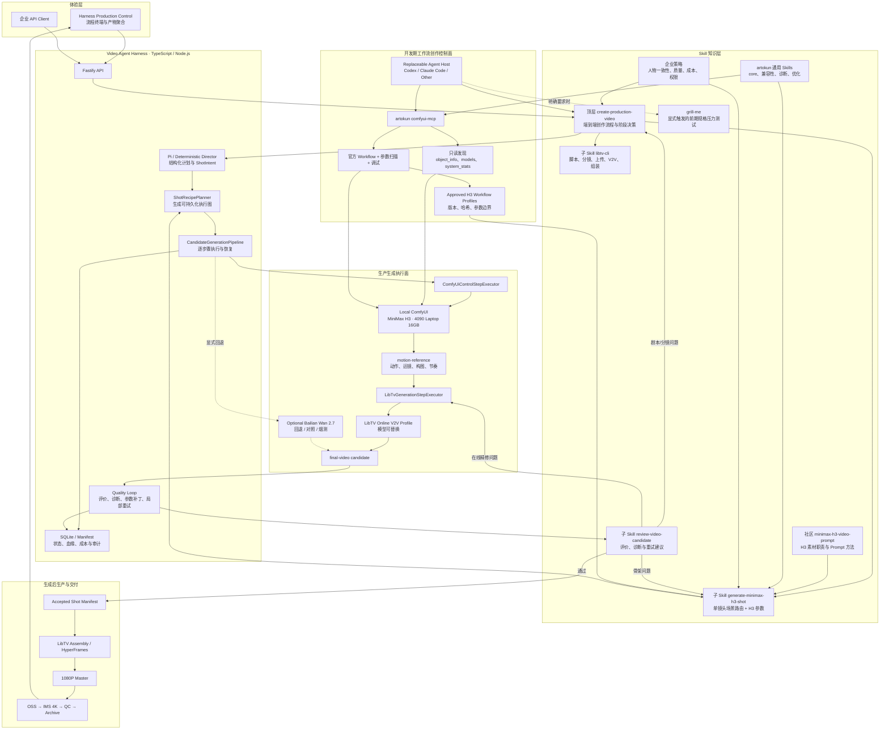

# Skill 与系统架构映射

## 1. 术语

本项目统一称为 **Video Agent Harness**。它不是 HarmonyOS 工程，也不使用 “Harmony” 作为架构层名称。

- **Agent Harness**：把创作目标编译为镜头意图、执行配方、质量决策和重试动作。
- **顶层创作 Skill**：拥有从 Brief 到交付的阶段状态机，负责调用专业子 Skill、工具和 Harness API。
- **专业子 Skill**：只处理一个模型或一个生产阶段，例如 MiniMax H3 单镜头生成；它不拥有整支成片流程。
- **MCP / Provider**：把 Agent 的结构化决定变成真实工具调用。
- **ComfyUI**：执行本地 MiniMax H3 节点图。
- **LibTV**：接收控制素材并调用可替换的在线 V2V Profile，也可承担创意规划和后期组装。
- **Post-production / Delivery**：HyperFrames、OSS、IMS、技术 QC 与归档。

## 2. 端到端大图



这里的“包含”是逻辑调用关系，不是把所有内容写进一个巨型 `SKILL.md`。顶层 Skill 只保存阶段状态机、输入输出契约和路由规则；H3、LibTV、质量评价等作为独立 Skill 按需加载，避免每次创作都占用全部模型知识上下文。

## 3. 最重要的边界

开发期与生产期不能使用同一权限模型。


- 开发期 MCP 可以读取节点、复制和修复 Workflow，但模型下载、未知自定义节点、付费 API 节点和服务重启默认禁止。
- 生产 Harness 不让 LLM 每次自由重搭整张图；它选择已批准 Profile，只修改声明过的输入与参数范围。
- 当前本地 `MinimaxHailuo03*` 是 ComfyUI Partner API 付费节点，与本地 MiniMax H3 权重路径不同；本地 H3 Profile 必须禁止误选这些节点。

## 4. Skill 与工程代码映射

| 能力 | Skill / 知识来源 | 工程模块 | 主要产物 | 状态 |
| --- | --- | --- | --- | --- |
| Brief 拆解与分镜 | Pi Director Prompt 与工具契约 | `src/application/director.ts` | `VideoPlan`、`VideoShot` | 已实现基线 |
| 端到端创作编排 | 项目顶层 `create-production-video` | 可替换 Agent Host + Harness API + `src/application/director.ts` | `ProductionRun`、阶段状态、阶段决策 | 仓库内 Skill 已创建；工程状态机已有基线 |
| 前期规格压力测试 | `grill-me` | Agent Host | 锁定决策、风险、待定项和可执行 Brief | 已从用户级全局 Skill 迁入仓库；仅显式触发 |
| H3 场景能力选择 | 社区 `minimax-h3-video-prompt` 知识 + 项目子 Skill | `skills/generate-minimax-h3-shot/` | `H3ShotPlan` | 仓库内 Skill、路由契约、FL2VA 与 REF2VA Profile 已创建并实测 |
| 参考素材职责 | H3 方法 + 企业一致性策略 | `skills/generate-minimax-h3-shot/` | 图片、视频、音频角色清单 | Skill 契约已创建；Studio 素材录入待扩展 |
| H3 参数选择 | 官方 H3 Workflow、实时节点 Schema、项目 Profile | `skills/generate-minimax-h3-shot/profiles/` | 分辨率、帧数、Sampler、Steps、Seed、首尾帧与多参考槽位 | FL2VA 首尾帧和 REF2VA 四图身份 Profile 已完成本地开发期验收；生产 Executor 图片上传待实现 |
| ComfyUI 探索与调试 | artokun `comfyui-core`、`troubleshooting`、optimizer | 开发期 `comfyui-mcp` | 已验证 Workflow 与诊断报告 | 待接入 |
| 镜头执行图 | 项目领域规则 | `src/application/shot-recipe-planner.ts` | `ShotRecipe` | 已实现两步基线 |
| ComfyUI API 执行 | 无；这是工具适配器 | `src/providers/comfyui-client.ts`、`comfyui-control-step-executor.ts` | `motion-reference` | `/prompt`、轮询和输出下载已实现；真实 H3 图已由开发期 Skill 验收，图片上传槽尚未接入生产 Executor |
| LibTV 在线精修 | LibTV 实时模型 Schema | `src/providers/libtv-cli-client.ts`、`libtv-generation-step-executor.ts` | `final-video` | 已实现适配器，待真实画布验收 |
| LibTV 阶段操作 | 仓库内官方 `libtv-cli` Skill 1.1.3 | `src/providers/libtv-cli-client.ts`、`libtv-generation-step-executor.ts`、Studio adapters | 分镜画布、在线候选、组装结果 | 官方 Skill 已随仓库版本化；CLI 适配已实现，顶层 Skill 路由待接入 |
| 候选评价与局部回跳 | `skills/review-video-candidate` + 分阶段评分策略 | `src/application/candidate-evaluator.ts`、`quality-gates.ts`、`candidate-generation-pipeline.ts` | 带 `control-draft / final-candidate / delivery` 阶段的 `EvaluationReport`、参数补丁 | 阶段化门禁已实现；真实 VLM 与自动回跳待实现 |
| 确定性动效和剪辑 | HyperFrames 模板规则 | `src/application/hyperframes-composition-service.ts` | `CompositionSpec` | 预览已实现 |
| 4K 交付 | OSS / IMS 技术策略 | `src/application/delivery-pipeline.ts` | Master、4K Asset、Delivery Manifest | Provider 已实现，云账号验收待完成 |

## 5. Skill 的内部职责

Skill 在逻辑上是父子层级，在文件系统中保持独立，便于触发、版本管理和渐进加载：

```text
skills/
  create-production-video/
    SKILL.md                       # Brief → 分镜 → 逐镜头生成 → 评价 → 组装 → 交付
    references/
      production-state-machine.md # 阶段、检查点、失败路由
      skill-contracts.md           # 调用各子 Skill 的类型化输入输出
      approval-policy.md           # 付费、下载、人工审核与交付门禁

  generate-minimax-h3-shot/
    SKILL.md                       # 一个 ShotIntent → 一个合格 H3 控制资产
    references/
      scene-routing.md             # T2V / I2V / 首尾帧 / Ref2V / 编辑
      profile-contract.md           # Profile 版本、参数、风险和验收契约
      ref2va-control.md             # 四图角色映射、动态节点键和 16GB 策略
    profiles/
      h3-fl2va-first-last-identity-preview.profile.json
      h3-fl2va-first-last-identity-preview.workflow.json
      h3-ref2va-four-image-identity-control.profile.json
      h3-ref2va-four-image-identity-control.workflow.json

  review-video-candidate/
    SKILL.md                       # 评价候选并返回阶段化重试决策
    references/
      scoring-rubric.md
```

仓库 `skills/` 是本项目所有可发布 Skill 的唯一源文件，并通过 `npm run skills:install -- --host=codex|claude` 安装到项目级宿主目录。官方 `libtv-cli` 快照和适配后的 `grill-me` 也已迁入仓库；社区 `minimax-h3-video-prompt` 的相关方法已吸收到项目 H3 Skill，不依赖用户全局目录。顶层 `create-production-video` 调用 `generate-minimax-h3-shot`、`libtv-cli` 和 `review-video-candidate`，但不直接配置 H3 Sampler。每个通过质量门的生成结果可以成为 Profile 的回归样本，但不能由一次主观结果自动改写生产参数。

## 6. 一次真实任务的数据流

1. Studio 提交 Brief、角色参考图、动作参考视频、声音素材和交付约束。
2. 顶层 `create-production-video` 调用 Director 和可选 LibTV Script 能力，形成分镜与结构化 `ShotIntent`；它不直接生成 ComfyUI JSON。
3. 顶层 Skill 对每个镜头调用 `generate-minimax-h3-shot`。H3 子 Skill 选择能力路径，为每份参考素材分配职责，并选择一个批准的 H3 Workflow Profile。
4. ShotRecipePlanner 把它编译为 `control-pass → final-generation` 两步执行图。
5. ComfyUI Executor 只替换 Profile 声明过的 Prompt、参考素材、帧数、Seed 等字段，生成 `motion-reference`。
6. LibTV Executor 上传控制视频，由当前在线 V2V Profile 生成最终候选；模型名不写死在架构中。
7. Quality Loop 区分骨架问题与在线精修问题，只回跳对应阶段。
8. 合格镜头进入 Accepted Shot Manifest，随后由 HyperFrames / LibTV Assembly 组装并通过 OSS、IMS 完成 4K 交付。
