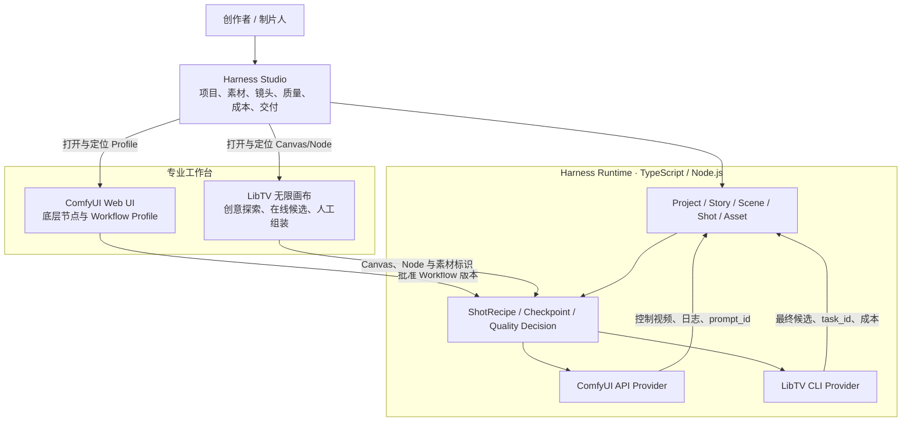

# Harness Studio 与专业画布边界

> 架构确认日期：2026-08-18

## 1. 结论

Harness Studio、ComfyUI 和 LibTV 不应合并成同一个编辑器。三者应当共享项目入口、资产身份、任务状态和产物血缘，但保留各自的专业交互方式。

- **Harness Studio：** 项目控制面和唯一事实来源；回答“整支作品现在是什么状态、每个镜头用了什么、为什么重试、哪个版本通过、花了多少钱、交付了什么”。
- **ComfyUI Workbench：** 底层生成工作台；回答“H3、LoRA、ControlNet、Sampler、VAE 和节点图怎样执行”。
- **LibTV Workbench：** 空间化创意工作台；回答“脚本、分镜、参考素材、在线模型候选和创意组装怎样在无限画布中展开”。
- **Harness Runtime：** 无 UI 的工程化中间层；通过 ComfyUI API 和 LibTV CLI 执行已批准的 Profile，保存检查点并回收产物。

因此采用：**入口合并、数据合并、状态合并；专业画布不合并。**

## 2. 产品层级



## 3. 为什么不能把 Studio 做成另一张无限画布

两者都展示素材，但组织问题不同：

| 维度 | Harness Studio | LibTV 无限画布 |
| --- | --- | --- |
| 范围 | 整个项目和全生命周期 | 某次创意探索或某组镜头 |
| 结构 | Project → Story → Scene → Shot → Candidate → Delivery | 空间节点与自由连接 |
| 主要用户动作 | 审批、追踪、比较、重试、签发 | 摆放、联想、生成、连接、创意组装 |
| 状态要求 | 稳定、可查询、可审计、可恢复 | 灵活、可探索、允许临时节点 |
| 是否为唯一事实来源 | 是 | 否；接受的结果必须回收到 Studio |

若在 Studio 重做无限画布，会重复 LibTV 的强项；若只使用 LibTV，则缺少跨 ComfyUI、LibTV、HyperFrames 和交付服务的项目治理。

## 4. 同一个供应商的“双重身份”

在架构图中，ComfyUI 和 LibTV 都需要拆成两个身份，避免把 UI 和执行协议混为一谈：

```text
ComfyUI Workbench  ──批准 Workflow/Profile──>  ComfyUI API Provider
LibTV Workbench    ──保存 Canvas/Node/Profile─> LibTV CLI Provider
```

- Workbench 面向人和开发期 Agent，允许探索与编辑。
- Provider 面向生产 Harness，只接收类型化输入，执行、恢复并返回结构化产物。

## 5. Studio 应拥有的项目资产模型

```text
Project
├── Brief / Brand Rules / Delivery Spec
├── Character Packs
│   ├── identity images
│   ├── costume / voice / negative constraints
│   └── approved reference versions
├── Scene Packs
│   ├── location / lighting / style / audio bed
│   └── continuity anchors
├── Storyboard
│   └── ShotIntent[]
│       ├── ComfyUI workflow/profile + control assets
│       ├── LibTV canvas/node + final candidates
│       ├── evaluation + retry decisions
│       └── accepted clip range
└── Master / Delivery Manifest
```

媒体大文件可以存于本地文件系统或对象存储；Studio 保存的是稳定的 Asset ID、角色、版本、URI、来源、授权和血缘，不要求把所有二进制文件塞进浏览器本身。

## 6. 集成契约

第一阶段不嵌入两套完整画布，只实现：

1. 一个 Harness Project 对应可选的 ComfyUI Profile 和 LibTV Canvas UUID；
2. 每个 Shot 保存 ComfyUI `prompt_id`、LibTV Node ID/Task ID 与双向跳转地址；
3. 上传到 LibTV 的控制视频继续使用同一个 Harness Asset ID；
4. ComfyUI/LibTV 输出回收后生成新 Asset Version，不覆盖原资产；
5. 只有被 Harness 质量门接受的 Candidate 才进入 Accepted Shot Manifest；
6. Studio 统一显示费用、失败责任阶段、重试动作和交付状态。

## 7. 当前实现状态

当前 3321 已实现项目列表与选择、`Project / Story Scene / Character Pack / Scene Pack / Asset Version` SQLite 持久化、素材职责分配、项目级 ComfyUI Profile / LibTV Canvas 绑定，以及从项目或具体场景创建 VideoJob。项目页同时回收 ComfyUI 控制资产、LibTV 最终候选、合格镜头与交付母版。

下一阶段差距是二进制素材直接上传、按 Shot 保存 LibTV Node 深链接、资产缩略图服务，以及从 ComfyUI/LibTV 回调自动登记新 Asset Version。这些不改变本文件定义的数据所有权边界。

“杭州 / 智慧城市”只保留为 HyperFrames 模板回归样例，不再作为 Studio 默认创作目标或默认标题。
